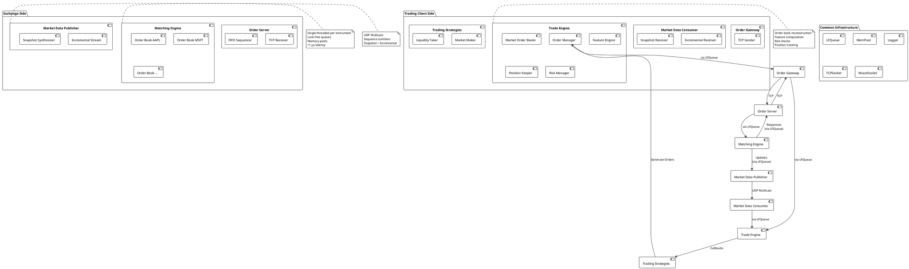
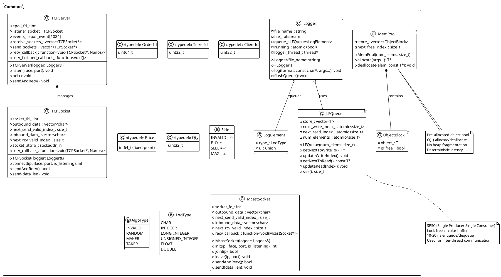
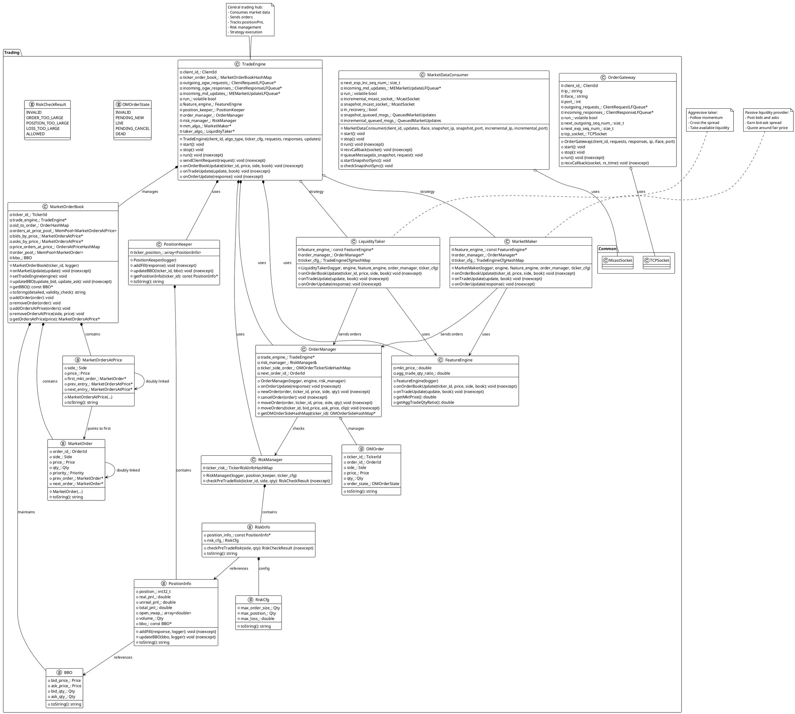
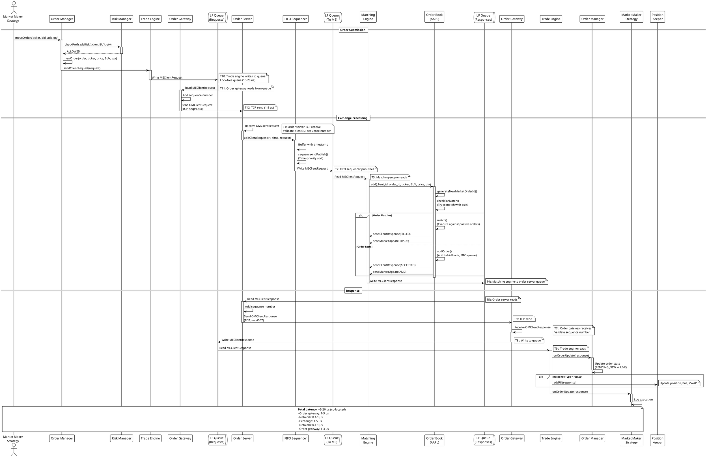
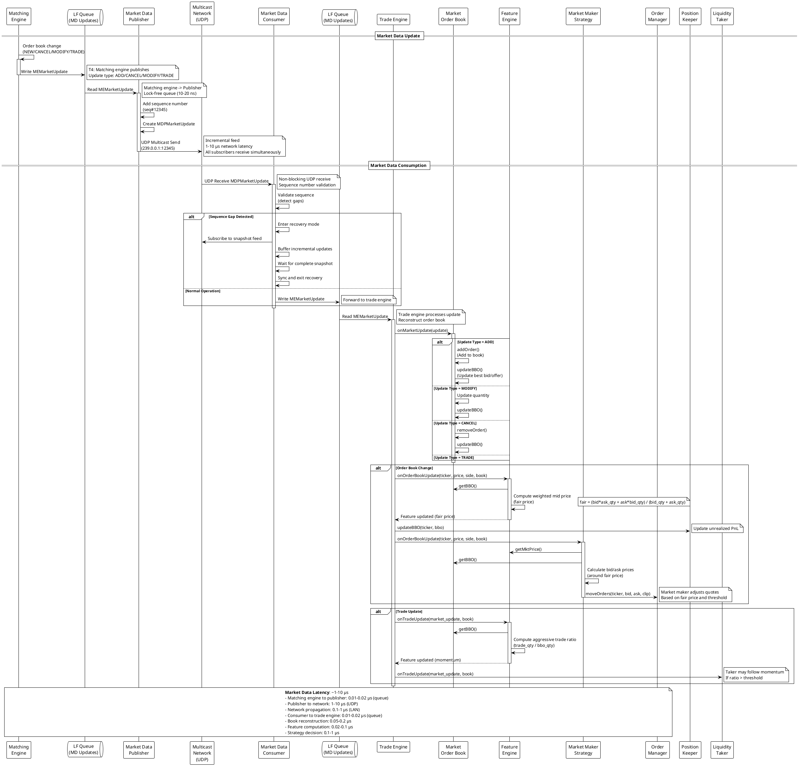
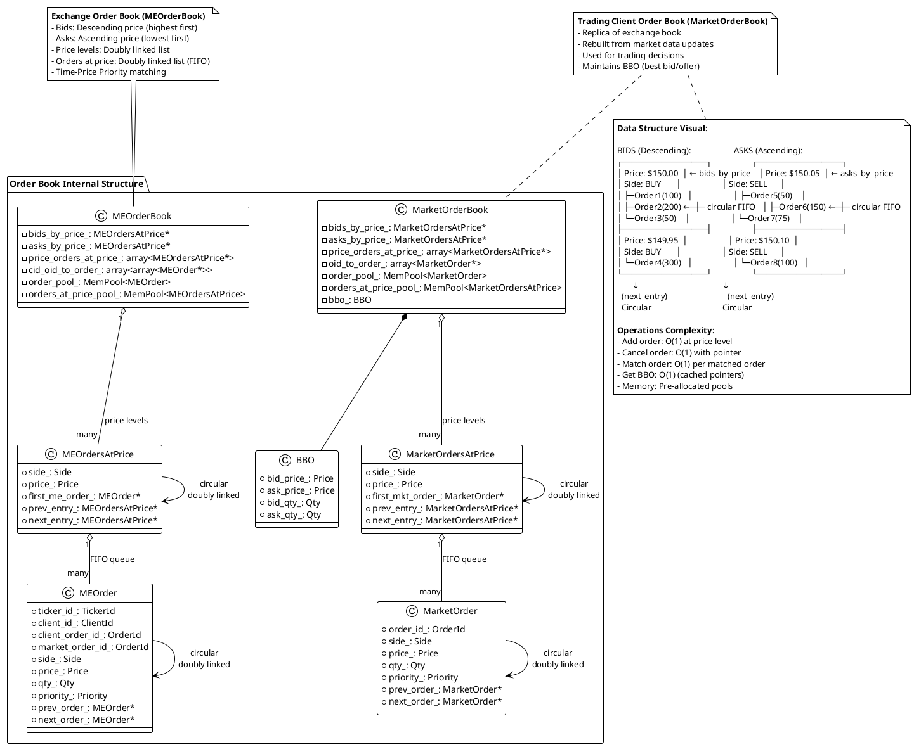

# UML Diagrams for Low-Latency Trading System

This document contains comprehensive UML diagrams for the low-latency trading system.

## Table of Contents
1. [System Architecture](#1-system-architecture)
2. [Common Module Classes](#2-common-module-classes)
3. [Exchange Module Classes](#3-exchange-module-classes)
4. [Trading Module Classes](#4-trading-module-classes)
5. [Order Submission Flow](#5-order-submission-flow-sequence)
6. [Market Data Flow](#6-market-data-flow-sequence)
7. [Order Book Data Structures](#7-order-book-data-structures)

---

## 1. System Architecture

High-level component diagram showing the main modules and their interactions.

---

## 2. Common Module Classes

Core infrastructure classes used throughout the system.

---

## 3. Exchange Module Classes

Exchange-side components: Order Server, Matching Engine, Market Data Publisher.

```plantuml
@startuml
!theme plain

namespace Exchange {
  ' Client Request/Response
  enum ClientRequestType {
    INVALID
    NEW
    CANCEL
  }
  
  enum ClientResponseType {
    INVALID
    ACCEPTED
    CANCELED
    FILLED
    CANCEL_REJECTED
  }
  
  class MEClientRequest <<packed>> {
    + type_: ClientRequestType
    + client_id_: ClientId
    + ticker_id_: TickerId
    + order_id_: OrderId
    + side_: Side
    + price_: Price
    + qty_: Qty
    --
    + toString(): string
  }
  
  class OMClientRequest <<packed>> {
    + seq_num_: size_t
    + me_client_request_: MEClientRequest
    --
    + toString(): string
  }
  
  class MEClientResponse <<packed>> {
    + type_: ClientResponseType
    + client_id_: ClientId
    + ticker_id_: TickerId
    + client_order_id_: OrderId
    + market_order_id_: OrderId
    + side_: Side
    + price_: Price
    + exec_qty_: Qty
    + leaves_qty_: Qty
    --
    + toString(): string
  }
  
  class OMClientResponse <<packed>> {
    + seq_num_: size_t
    + me_client_response_: MEClientResponse
    --
    + toString(): string
  }
  
  ' Market Data
  enum MarketUpdateType {
    INVALID
    CLEAR
    ADD
    MODIFY
    CANCEL
    TRADE
    SNAPSHOT_START
    SNAPSHOT_END
  }
  
  class MEMarketUpdate <<packed>> {
    + type_: MarketUpdateType
    + order_id_: OrderId
    + ticker_id_: TickerId
    + side_: Side
    + price_: Price
    + qty_: Qty
    + priority_: Priority
    --
    + toString(): string
  }
  
  class MDPMarketUpdate <<packed>> {
    + seq_num_: size_t
    + me_market_update_: MEMarketUpdate
    --
    + toString(): string
  }
  
  ' Order Server
  class OrderServer {
    - iface_: string
    - port_: int
    - outgoing_responses_: ClientResponseLFQueue*
    - run_: volatile bool
    - tcp_server_: TCPServer
    - fifo_sequencer_: FIFOSequencer
    - cid_next_outgoing_seq_num_: array<size_t>
    - cid_next_exp_seq_num_: array<size_t>
    - cid_tcp_socket_: array<TCPSocket*>
    --
    + OrderServer(requests, responses, iface, port)
    + start(): void
    + stop(): void
    + run(): void {noexcept}
    - recvCallback(socket, rx_time): void {noexcept}
    - recvFinishedCallback(): void {noexcept}
  }
  
  class FIFOSequencer {
    - pending_client_requests_: vector<RecvTimeClientRequest>
    - client_request_queue_: ClientRequestLFQueue*
    --
    + FIFOSequencer(queue)
    + addClientRequest(rx_time, request): void
    + sequenceAndPublish(): void
  }
  
  ' Matching Engine
  class MatchingEngine {
    - ticker_order_book_: OrderBookHashMap
    - incoming_requests_: ClientRequestLFQueue*
    - outgoing_ogw_responses_: ClientResponseLFQueue*
    - outgoing_md_updates_: MEMarketUpdateLFQueue*
    - run_: volatile bool
    - next_market_order_id_: OrderId
    --
    + MatchingEngine(requests, responses, updates)
    + start(): void
    + stop(): void
    + run(): void {noexcept}
    + processClientRequest(request): void {noexcept}
    + sendClientResponse(response): void {noexcept}
    + sendMarketUpdate(update): void {noexcept}
  }
  
  class MEOrderBook {
    - ticker_id_: TickerId
    - matching_engine_: MatchingEngine*
    - cid_oid_to_order_: ClientOrderHashMap
    - orders_at_price_pool_: MemPool<MEOrdersAtPrice>
    - bids_by_price_: MEOrdersAtPrice*
    - asks_by_price_: MEOrdersAtPrice*
    - price_orders_at_price_: OrdersAtPriceHashMap
    - order_pool_: MemPool<MEOrder>
    - client_response_: MEClientResponse
    - market_update_: MEMarketUpdate
    --
    + MEOrderBook(ticker_id, logger, engine)
    + add(client_id, order_id, ticker_id, side, price, qty): void {noexcept}
    + cancel(client_id, order_id, ticker_id): void {noexcept}
    + toString(detailed, validity_check): string
    - checkForMatch(...): void
    - match(...): void
    - addOrder(order): void
    - removeOrder(order): void
    - addOrdersAtPrice(orders): void
    - removeOrdersAtPrice(side, price): void
    - getOrdersAtPrice(price): MEOrdersAtPrice*
    - getNextPriority(price): Priority
  }
  
  struct MEOrder {
    + ticker_id_: TickerId
    + client_id_: ClientId
    + client_order_id_: OrderId
    + market_order_id_: OrderId
    + side_: Side
    + price_: Price
    + qty_: Qty
    + priority_: Priority
    + prev_order_: MEOrder*
    + next_order_: MEOrder*
    --
    + MEOrder(...)
    + toString(): string
  }
  
  struct MEOrdersAtPrice {
    + side_: Side
    + price_: Price
    + first_me_order_: MEOrder*
    + prev_entry_: MEOrdersAtPrice*
    + next_entry_: MEOrdersAtPrice*
    --
    + MEOrdersAtPrice(...)
    + toString(): string
  }
  
  ' Market Data Publisher
  class MarketDataPublisher {
    - next_inc_seq_num_: size_t
    - outgoing_md_updates_: MEMarketUpdateLFQueue*
    - snapshot_md_updates_: MDPMarketUpdateLFQueue
    - run_: volatile bool
    - incremental_socket_: McastSocket
    - snapshot_synthesizer_: SnapshotSynthesizer*
    --
    + MarketDataPublisher(updates, iface, snapshot_ip, snapshot_port, incremental_ip, incremental_port)
    + start(): void
    + stop(): void
    + run(): void {noexcept}
  }
  
  class SnapshotSynthesizer {
    - ticker_order_book_: OrderBookHashMap
    - run_: volatile bool
    - incremental_mcast_socket_: McastSocket
    --
    + SnapshotSynthesizer(queue, iface, ip, port)
    + start(): void
    + stop(): void
    + run(): void {noexcept}
  }
  
  ' Relationships
  OMClientRequest *-- MEClientRequest : contains
  OMClientResponse *-- MEClientResponse : contains
  MDPMarketUpdate *-- MEMarketUpdate : contains
  
  OrderServer o-- FIFOSequencer : uses
  OrderServer o-- Common.TCPServer : uses
  
  MatchingEngine *-- MEOrderBook : manages
  MEOrderBook *-- MEOrder : contains
  MEOrderBook *-- MEOrdersAtPrice : contains
  MEOrder --> MEOrder : doubly linked
  MEOrdersAtPrice --> MEOrdersAtPrice : doubly linked
  MEOrdersAtPrice --> MEOrder : points to first
  
  MarketDataPublisher o-- SnapshotSynthesizer : manages
  MarketDataPublisher o-- Common.McastSocket : uses
  SnapshotSynthesizer o-- Common.McastSocket : uses
}

note top of MEOrderBook
  Time-Price Priority Matching
  Doubly linked lists for FIFO
  Memory pools (no heap)
  O(1) add/cancel/match
  ~20-50 ns per operation
end note

note top of MarketDataPublisher
  UDP Multicast streams:
  - Incremental (real-time)
  - Snapshot (recovery)
  Sequence numbers (gap detection)
end note

@enduml
```

---

## 4. Trading Module Classes

Trading client components: Order Gateway, Market Data Consumer, Trade Engine, Strategies.

---

## 5. Order Submission Flow (Sequence)

Sequence diagram showing order flow from trading strategy to execution report.

---

## 6. Market Data Flow (Sequence)

Sequence diagram showing market data flow from exchange to trading strategy.

---

## 7. Order Book Data Structures

Detailed class diagram showing order book internal structure (doubly-linked lists).

---

## Summary

This low-latency trading system demonstrates:

1. **Architecture**: Separation of exchange and trading client with lock-free communication
2. **Performance**: Sub-microsecond latency for critical paths (order book operations)
3. **Data Structures**: Custom doubly-linked lists with memory pools (no heap allocation)
4. **Communication**: TCP for reliable order flow, UDP multicast for market data
5. **Risk Management**: Pre-trade checks (position limits, loss limits)
6. **Trading Strategies**: Market maker (provide liquidity) and liquidity taker (consume liquidity)
7. **Features**: Fair price calculation, momentum detection

**Key Performance Metrics:**
- Order book operation: 20-50 ns
- Lock-free queue: 10-20 ns
- End-to-end order latency: 5-20 μs (co-located)
- Market data latency: 1-10 μs

**Design Principles:**
- Lock-free (no mutexes)
- Memory pools (no heap)
- Fixed-point arithmetic (no floating-point for prices)
- Single-threaded matching engine (no contention)
- Pre-allocated buffers (deterministic latency)
